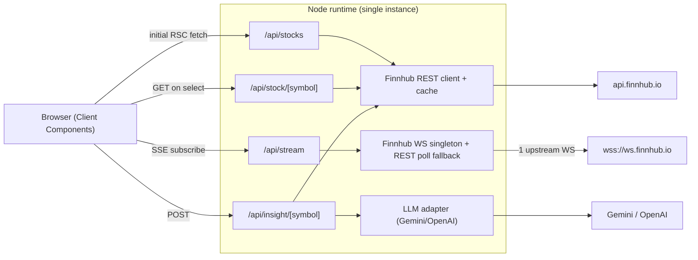
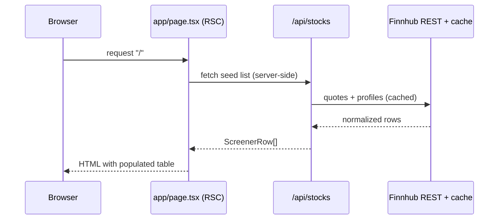
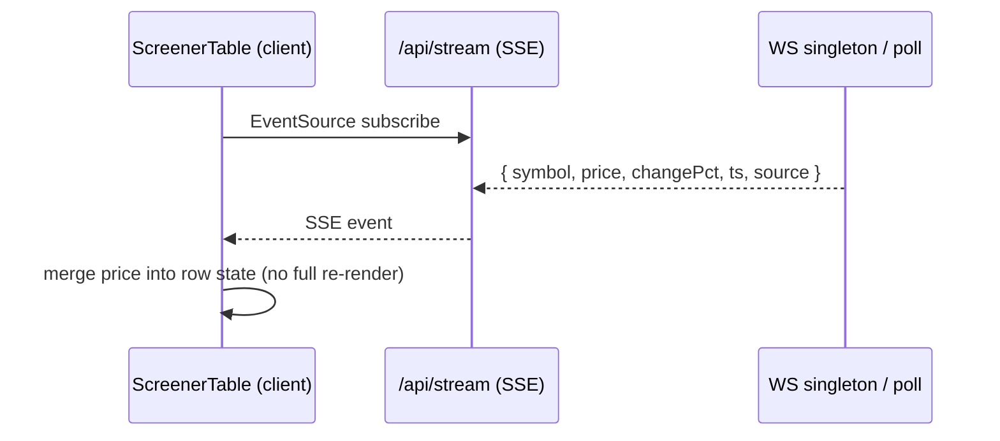
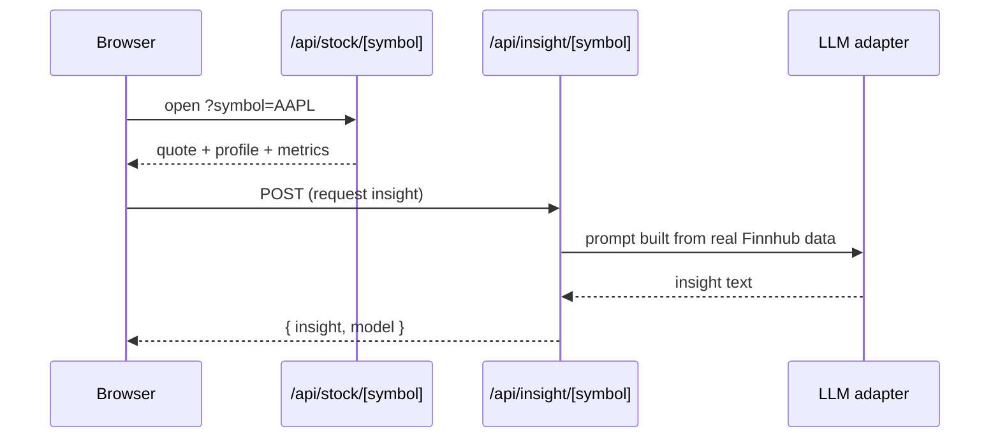

# Architecture & Project Structure

This document describes **what** the system is and **where** things live. For the
reasoning behind these choices, see [DECISIONS.md](./DECISIONS.md).

## System overview

A single Next.js app (App Router, Node runtime) serves both the UI and a thin
server-side API layer. The browser never talks to Finnhub or the LLM directly —
all third-party calls and secrets stay server-side.



**Key idea:** the Finnhub API key never reaches the browser. One server-side
upstream WebSocket fans out to all clients over SSE; when the US market is closed,
the same stream is fed by periodic REST `/quote` polling so it always feels live.

## Layered responsibilities

| Layer | Location | Responsibility |
| --- | --- | --- |
| Pages (RSC) | `app/*` | Server-render first paint, compose client components |
| API routes | `app/api/*` | Validate, call data/LLM layer, return typed JSON/SSE (Node runtime) |
| Screener feature | `components/screener/*` | Live table, row, status badge, empty/no-match states (Tailwind only) |
| Filter feature | `components/filter/*` | Controlled filter bar (chip + input UI); no URL logic inside |
| Global UI | `components/*.tsx` | Layout-level components (ThemeToggle); future: DetailPanel, InsightCard |
| Data layer | `lib/finnhub/*` | REST client, TTL cache, WS singleton, symbol universe, raw types, shared math |
| AI layer | `lib/llm/*` | Provider-agnostic LLM adapter (planned) |
| Shared types | `lib/types.ts` | App-facing DTOs — decoupled from raw Finnhub shapes |
| Filters | `lib/filters.ts` | Pure filter types, `applyFilters`, and URL serialisation helpers |
| Formatters | `lib/formatters.ts` | Pure price/market-cap formatting helpers (no React) |
| HTTP helpers | `lib/http.ts` | Route response envelopes and status mapping |

## Project structure

Feature-first, root-level layout (no `src/` directory), so paths map directly to
responsibilities. `[ ]` marks items planned in later phases.

Legend: `[x]` implemented · `[ ]` planned in a later phase.

```
stock-screener/
├── app/
│   ├── api/                        # Route Handlers (Node runtime)
│   │   ├── stocks/route.ts         # [x] GET screener list
│   │   ├── stock/[symbol]/route.ts # [x] GET detail (quote+profile+metrics)
│   │   ├── stream/route.ts         # [x] GET SSE live prices
│   │   └── insight/[symbol]/       # [ ] POST LLM insight
│   ├── globals.css                 # [x] Tailwind v4 + dark variant + flash keyframes
│   ├── layout.tsx                  # [x] Root layout, theme script, header
│   └── page.tsx                    # [x] Home RSC — fetches seed, mounts ScreenerTable
├── components/
│   ├── screener/                   # Feature folder: everything screener-related
│   │   ├── ScreenerTable.tsx       # [x] "use client" — SSE state, filter state, URL sync
│   │   ├── StockRow.tsx            # [x] presentational row (FlashDir type)
│   │   ├── StatusBadge.tsx         # [x] live/delayed/reconnecting badge (ConnectionStatus)
│   │   └── ScreenerEmpty.tsx       # [x] EmptyState + LoadError + NoMatches
│   ├── filter/                     # Feature folder: filter bar
│   │   └── FilterBar.tsx           # [x] controlled filter chip + input UI
│   ├── ThemeToggle.tsx             # [x] dark/light toggle (layout-level concern)
│   ├── DetailPanel.tsx             # [ ] ?symbol= side panel (Step 7)
│   └── InsightCard.tsx             # [ ] AI insight (Step 8)
├── lib/
│   ├── types.ts                    # [x] app-facing DTOs (StockQuote, ScreenerRow, StockDetail…)
│   ├── filters.ts                  # [x] ScreenerFilters type, applyFilters, URL helpers
│   ├── formatters.ts               # [x] pure price/marketCap formatting helpers
│   ├── http.ts                     # [x] route response helpers (jsonOk/jsonError/statusForCode)
│   ├── finnhub/
│   │   ├── types.ts                # [x] raw Finnhub response shapes
│   │   ├── client.ts               # [x] typed REST wrappers + screener/detail composers
│   │   ├── cache.ts                # [x] in-memory TTL cache + single-flight
│   │   ├── socket.ts               # [x] upstream WS singleton + REST poll fallback
│   │   ├── math.ts                 # [x] shared numeric helpers (round2) — no duplication
│   │   └── universe.ts             # [x] ~25 US ticker symbols (never prices)
│   └── llm/                        # [ ] LLM adapter (Step 7)
│       ├── provider.ts             # [ ] LLMProvider interface + auto-selector
│       ├── gemini.ts               # [ ] Gemini 2.0-flash implementation
│       └── openai.ts               # [ ] OpenAI gpt-4o-mini implementation
├── docs/
│   ├── DECISIONS.md                # [x] decisions & trade-offs
│   ├── ARCHITECTURE.md             # [x] this file
│   └── API.md                      # [x] per-route contracts
├── .claude/CLAUDE.md               # AI guidance + hard constraints
├── .env.example                    # documented env vars (server-side only)
├── README.md                       # entry point + navigation
└── (next.config.ts, tsconfig.json, eslint.config.mjs, postcss.config.mjs)
```

## Data flows

### Initial load (fast first paint)


### Live updates


### Detail + AI insight


## Rendering strategy

- **Server components** for the first paint (`app/page.tsx` fetches seed data).
- **Client components** only where needed: the live table (SSE), filter bar (URL
  state), detail panel, and insight card.
- **SSE** pushes price deltas; the client merges them into row state without a full
  re-render to avoid jank.
- **URL search params** hold filter + selection state for shareable, reload-safe
  views.

## Conventions

- All route handlers: `export const runtime = 'nodejs'`; the SSE route also sets
  `dynamic = 'force-dynamic'`.
- Secrets are server-side only (never `NEXT_PUBLIC_`).
- Raw Finnhub types stay in `lib/finnhub/types.ts`; normalize to `lib/types.ts`
  DTOs before returning to the UI.
- Strict TypeScript, no `any` (justified inline if ever unavoidable).
