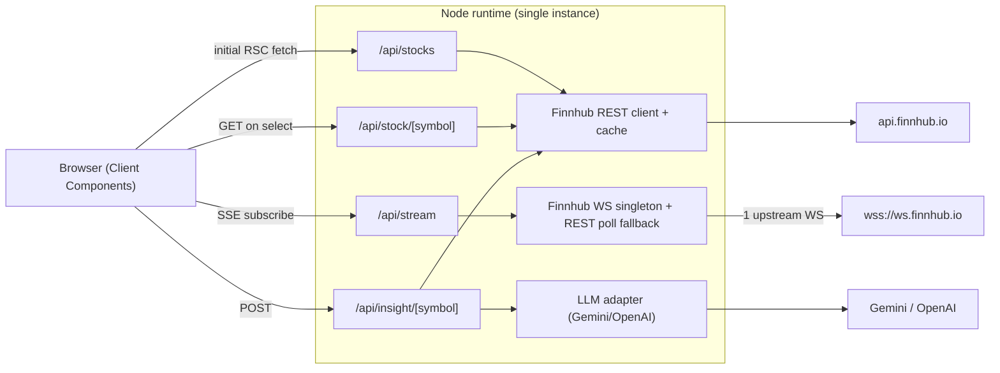
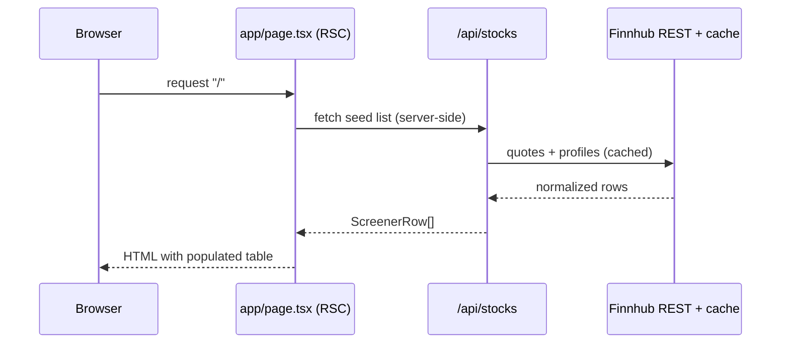
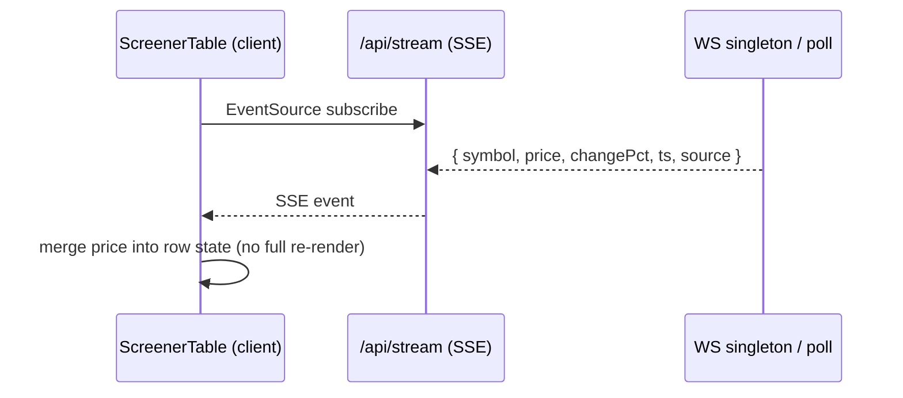
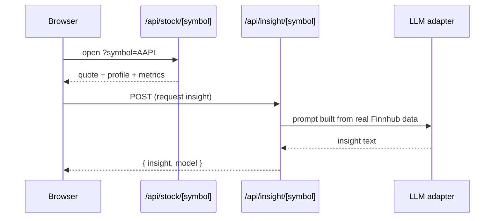

# Architecture & Project Structure

This document describes **what** the system is and **where** things live. For the
reasoning behind these choices, see [DECISIONS.md](./DECISIONS.md).

## System overview

A single Next.js app (App Router, Node runtime) serves both the UI and a thin
server-side API layer. The browser never talks to Finnhub or the LLM directly —
all third-party calls and secrets stay server-side.



**Key idea:** the Finnhub API key never reaches the browser. One server-side
upstream WebSocket fans out to all clients over SSE; when the US market is closed,
the same stream is fed by periodic REST `/quote` polling so it always feels live.

## Layered responsibilities

| Layer | Location | Responsibility |
| --- | --- | --- |
| Pages (RSC) | `app/*` | Server-render first paint, compose client components |
| API routes | `app/api/*` | Validate, call data/LLM layer, return typed JSON/SSE (Node runtime) |
| Feature components | `components/*` | Screener table, filters, detail panel, insight card (Tailwind only) |
| Data layer | `lib/finnhub/*` | REST client, TTL cache, WS singleton, symbol universe, raw types |
| AI layer | `lib/llm/*` | Provider-agnostic LLM adapter |
| Shared types/utils | `lib/*` | App-facing DTOs and pure helpers |

## Project structure

Feature-first, root-level layout (no `src/` directory), so paths map directly to
responsibilities. `[ ]` marks items planned in later phases.

Legend: `[x]` implemented · `[ ]` planned in a later phase.

```
stock-screener/
├── app/
│   ├── api/                 # Route Handlers (Node runtime)
│   │   ├── stocks/          # [x] GET screener list
│   │   ├── stock/[symbol]/  # [x] GET detail (quote+profile+metrics)
│   │   ├── stream/          # [ ] GET SSE live prices
│   │   └── insight/[symbol]/# [ ] POST LLM insight
│   ├── globals.css          # [x] Tailwind v4 entry (@import "tailwindcss")
│   ├── layout.tsx           # [x] Root layout + metadata
│   └── page.tsx             # [x] Home placeholder (RSC) -> ScreenerTable later
├── components/              # Client/presentational components (Tailwind only)
│   ├── ScreenerTable.tsx    # [ ] live table: SSE merge, sort
│   ├── FilterBar.tsx        # [ ] URL-synced filters
│   ├── DetailPanel.tsx      # [ ] ?symbol= side panel
│   └── InsightCard.tsx      # [ ] AI insight (isolated failures)
├── lib/
│   ├── types.ts             # [x] app-facing DTOs (+ StockDetail)
│   ├── http.ts              # [x] route response helpers (jsonOk/jsonError/status)
│   ├── finnhub/
│   │   ├── types.ts         # [x] raw Finnhub response shapes
│   │   ├── client.ts        # [x] typed REST wrappers + screener/detail compose
│   │   ├── cache.ts         # [x] in-memory TTL cache + single-flight
│   │   ├── socket.ts        # [ ] upstream WS singleton + poll fallback
│   │   └── universe.ts      # [x] ~25 US ticker symbols
│   └── llm/
│       ├── provider.ts      # [ ] LLMProvider interface + selector
│       ├── gemini.ts        # [ ] Gemini implementation
│       └── openai.ts        # [ ] OpenAI implementation
├── docs/
│   ├── DECISIONS.md         # [x] decisions & trade-offs
│   ├── ARCHITECTURE.md      # [x] this file
│   └── API.md               # [x] per-route contracts
├── .claude/CLAUDE.md        # AI guidance + hard constraints
├── .env.example             # documented env vars (server-side only)
├── README.md                # entry point + navigation
└── (next.config.ts, tsconfig.json, eslint.config.mjs, postcss.config.mjs)
```

## Data flows

### Initial load (fast first paint)


### Live updates


### Detail + AI insight


## Rendering strategy

- **Server components** for the first paint (`app/page.tsx` fetches seed data).
- **Client components** only where needed: the live table (SSE), filter bar (URL
  state), detail panel, and insight card.
- **SSE** pushes price deltas; the client merges them into row state without a full
  re-render to avoid jank.
- **URL search params** hold filter + selection state for shareable, reload-safe
  views.

## Conventions

- All route handlers: `export const runtime = 'nodejs'`; the SSE route also sets
  `dynamic = 'force-dynamic'`.
- Secrets are server-side only (never `NEXT_PUBLIC_`).
- Raw Finnhub types stay in `lib/finnhub/types.ts`; normalize to `lib/types.ts`
  DTOs before returning to the UI.
- Strict TypeScript, no `any` (justified inline if ever unavoidable).
