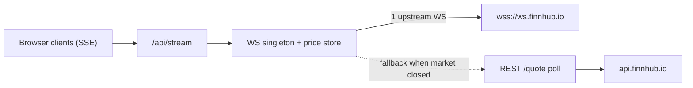

# Decisions & Trade-offs

This document records the important architectural and implementation decisions
for the Real-Time Stock Screener, along with the trade-offs each one carries.
The goal is to document choices explicitly rather than make them silently.

Format: each decision lists the **context**, the **decision**, and the
**trade-offs / alternatives considered**.

> Status legend: ✅ decided · 🔜 planned (decided, not yet implemented).

---

## 1. Framework, language, and rendering strategy ✅

**Context.** The assignment mandates Next.js (App Router) and TypeScript, with a
real-time UI that must feel live and load fast.

**Decision.**
- **Next.js 16 App Router** with **React Server Components (RSC)** for the initial
  page, and **client components** only where interactivity/streaming is needed.
- The home page (`app/page.tsx`) is a server component that fetches the screener
  seed list server-side for a fast, populated first paint, then hands off to a
  client `ScreenerTable` that owns live updates, sorting, and filtering.
- **TypeScript strict** mode, with `noUncheckedIndexedAccess` and
  `noImplicitOverride` additionally enabled.

**Rendering strategy in one line:** *server-render the first snapshot, then let a
single client component stream live deltas on top of it.*

**Trade-offs / alternatives.**
- Pure client-side fetching (CSR) was rejected: slower first paint and it would
  expose more logic/keys to the browser.
- Full SSR-on-every-request for live data was rejected: the data changes per
  second; pushing deltas over SSE is far cheaper than re-rendering on the server.

---

## 2. Data provider: Finnhub free tier only ✅

**Context.** A hard constraint: Finnhub free tier is the **only** permitted
market-data source.

**Decision.** All quotes, company profiles, and fundamental metrics come from
Finnhub REST (`/quote`, `/stock/profile2`, `/stock/metric`, `/search`), and all
real-time prices come from the Finnhub WebSocket (`wss://ws.finnhub.io`). No other
provider is introduced, and **no price is ever mocked or hardcoded**.

**Trade-offs.**
- Free-tier limits shape the whole design: ~**60 REST calls/min** and a
  ~**50-symbol** WebSocket cap. These constraints drive decisions #3–#5.
- The free-tier trade WebSocket primarily streams **US equities**, and trades only
  flow during US market hours — hence the polling fallback in #3.

---

## 3. Real-time strategy: server-side WS singleton + SSE + REST poll fallback ✅

**Context.** We must use the Finnhub WebSocket feed, keep the API key off the
browser, and still feel "live" when the US market is closed.

**Decision.**
- A **single server-side upstream WebSocket** (one connection per Node instance)
  subscribes to the symbol universe and stores the latest trade price per symbol
  in memory.
- The browser receives updates via **Server-Sent Events (SSE)** from
  `GET /api/stream` — the server **fans out** one upstream feed to all clients.
- When the market is closed (no WS trades arriving), the same SSE stream is fed by
  a periodic **REST `/quote` poll loop**, so the UI keeps updating with real data.
- Each SSE event carries a `source: "ws" | "poll"` field so the UI can show a
  freshness/"delayed" badge.

**Trade-offs.**
- **SSE over a raw browser WebSocket to Finnhub:** chosen so the **API key never
  reaches the browser** and to respect the 50-symbol cap with exactly one upstream
  subscription regardless of how many tabs are open. The Finnhub WS constraint is
  still honored — it is consumed upstream, server-side.
- **In-memory singleton assumes a single Node instance.** This is not
  horizontally-scalable as-is (multiple serverless instances would each open a
  socket and hold separate state). Documented and accepted for a 4–5 hour
  assignment; a production version would externalize state (e.g. Redis pub/sub) and
  run a dedicated socket worker.
- SSE (vs. client WebSocket) is one-directional, which is all we need (server →
  client price pushes), and is simpler and proxy-friendly.

---

## 4. Data flow and caching ✅

**Context.** Static-ish fundamentals vs. fast-moving prices have very different
freshness needs, and we must stay under 60 REST calls/min.

**Decision.** An in-memory TTL cache (`lib/finnhub/cache.ts`) with per-data-type
lifetimes:

| Data | Source | TTL | Why |
| --- | --- | --- | --- |
| Company profile | `/stock/profile2` | ~12h | Rarely changes |
| Metrics (P/E, 52w) | `/stock/metric` | ~1h | Slow-moving fundamentals |
| Quote snapshot | `/quote` | ~5–10s | Seed/refresh price |
| Live price | WebSocket | n/a (push) | Real-time deltas |

Fundamentals (P/E, 52-week range) are fetched **lazily on the detail view** rather
than for every row on initial load, to keep the first screen well under the rate
limit (~25 symbols × quote+profile ≈ 50 calls; profiles cached long).

**Trade-offs.** Cache is per-instance and lost on restart (acceptable here). Lazy
metrics mean the detail panel has a brief load on first open — a deliberate trade
to protect the rate budget.

---

## 5. Symbol universe: ~25 hardcoded US tickers ✅

**Context.** The 50-symbol WS cap and 60/min REST limit require a bounded universe.

**Decision.** A curated list of ~25 liquid US tickers (`lib/finnhub/universe.ts`).
Only the **symbol list** is hardcoded — **never prices**.

**Trade-offs.** Less flexible than a fully search-driven universe, but predictable,
fast, and rate-limit-safe. Finnhub `/search` is still wired so the universe can be
made dynamic later without architectural change.

---

## 6. AI insight: provider-agnostic real LLM adapter ✅ / 🔜

**Context.** The AI insight feature must call a **real LLM**, and key availability
varies by developer.

**Decision.** A small `LLMProvider` interface in `lib/llm/` with implementations
that **auto-select** based on which key is present: **Gemini `2.0-flash`** (free
tier, default) or **OpenAI `gpt-4o-mini`**, overridable via `LLM_PROVIDER`. The
server builds a compact, factual summary of a stock's real Finnhub data and asks
the model to generate the insight; raw provider payloads are never returned to the
client (only `{ insight, model }`).

**Trade-offs.** An abstraction layer costs a little indirection but makes the real
call site explicit, swappable, and testable, and avoids vendor lock-in. Gemini is
the default purely because it has a genuinely free tier.

---

## 7. Type safety and the no-`any` rule ✅

**Decision.** `strict` TypeScript everywhere; **no `any`** (an inline comment is
required to justify any unavoidable use). Raw Finnhub response shapes live in
`lib/finnhub/types.ts`; app-facing DTOs live in `lib/types.ts`. Raw payloads are
**normalized before reaching the UI** so components depend on stable, intentful
types rather than provider quirks.

**Trade-offs.** Slightly more boilerplate (two type layers), bought back in
refactor safety and a clean UI/provider boundary.

---

## 8. Styling: Tailwind CSS v4, no UI component libraries ✅

**Context.** Hard constraint: no UI kits (shadcn/MUI/Chakra/Radix/Ant/etc.);
Tailwind is allowed.

**Decision.** Tailwind **v4** only, hand-built components. Note the v4 model
differs from v3: `app/globals.css` uses `@import "tailwindcss"` with **automatic
content detection** — there is no `tailwind.config.ts` and no
`@tailwind base/components/utilities` directives.

**Trade-offs.** Building primitives (table, panel, badges) by hand is a bit more
work than importing a kit, but it's required by the constraints and keeps the
bundle lean. v4's zero-config content detection removes a class of
"styles-not-applied" misconfigurations.

---

## 9. API surface and error handling ✅ / 🔜

**Decision.** Four Node-runtime route handlers, each returning a typed success
shape or a typed error envelope `{ error: { code, message } }` — they **never
throw to the client**:

- `GET /api/stocks` — normalized screener seed list (cached).
- `GET /api/stream` — SSE live prices (`source: ws|poll`); `dynamic = 'force-dynamic'`.
- `GET /api/stock/[symbol]` — detail: quote + profile + metrics.
- `POST /api/insight/[symbol]` — LLM insight from a server-built data summary.

Full per-route contracts will live in `docs/API.md` (added in the API phase).

---

## 10. Failure handling / resilience ✅

**Decision.** Degrade gracefully rather than break:

- **WS drop** → auto-reconnect with backoff + REST poll fallback; UI shows a
  "delayed/polling" badge instead of going blank.
- **Single REST failure** → keep the last-known value, mark it stale, continue.
- **AI failure** → isolated to the insight card; the screener and detail keep
  working (separate React error boundary).
- **Server routes** are wrapped in try/catch and always return the typed error
  envelope.

**Trade-offs.** "Last-known + stale badge" can briefly show slightly old data, but
that is strictly better UX than an error state or a frozen table.

---

## 11. Filters (finance-driven, URL-encoded) 🔜

**Decision.** At least three meaningful filters, all encoded in URL search params
(shareable, refresh-recoverable):

1. **Search** by symbol/company name — fast lookup.
2. **% change range** — find gainers/losers / momentum.
3. **Market-cap buckets** (small/mid/large/mega) — company size.
4. **P/E ratio range** — valuation.
5. **Proximity to 52-week high/low** — relative position (stretch).

**Trade-offs.** URL-as-state is slightly more verbose than local state but gives
shareable, reload-safe views for free and keeps filter logic declarative.

---

## Notable trade-offs summary (called out, not hidden)

- **Single-instance assumption** for the SSE/WS singleton and in-memory cache —
  fine for the assignment, not multi-instance/serverless-ready without external
  state.
- **Lazy fundamentals** on detail to protect the 60/min REST budget.
- **Hardcoded symbol universe** (symbols only) to bound API usage — swappable for
  search-driven later.
- **Market-closed behavior** relies on REST polling; updates are real but less
  frequent than live trades.

## Future improvements

- Externalize live state (Redis pub/sub) + dedicated socket worker for horizontal
  scaling.
- Persist user watchlists and make the universe search-driven.
- Add a lightweight test suite (e.g. Vitest) and a `typecheck` script.
- Historical charts (candles) and additional fundamental filters.
