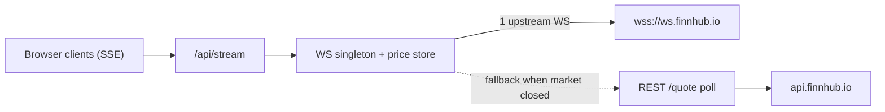

# Decisions & Trade-offs

This document records the important architectural and implementation decisions
for the Real-Time Stock Screener, along with the trade-offs each one carries.
The goal is to document choices explicitly rather than make them silently.

Format: each decision lists the **context**, the **decision**, and the
**trade-offs / alternatives considered**.

> Status legend: ✅ decided · 🔜 planned (decided, not yet implemented).

---

## 1. Framework, language, and rendering strategy ✅

**Context.** The assignment mandates Next.js (App Router) and TypeScript, with a
real-time UI that must feel live and load fast.

**Decision.**
- **Next.js 16 App Router** with **React Server Components (RSC)** for the initial
  page, and **client components** only where interactivity/streaming is needed.
- The home page (`app/page.tsx`) is a server component that fetches the screener
  seed list server-side for a fast, populated first paint, then hands off to a
  client `ScreenerTable` that owns live updates, sorting, and filtering.
- **TypeScript strict** mode, with `noUncheckedIndexedAccess` and
  `noImplicitOverride` additionally enabled.

**Rendering strategy in one line:** *server-render the first snapshot, then let a
single client component stream live deltas on top of it.*

**Trade-offs / alternatives.**
- Pure client-side fetching (CSR) was rejected: slower first paint and it would
  expose more logic/keys to the browser.
- Full SSR-on-every-request for live data was rejected: the data changes per
  second; pushing deltas over SSE is far cheaper than re-rendering on the server.

---

## 2. Data provider: Finnhub free tier only ✅

**Context.** A hard constraint: Finnhub free tier is the **only** permitted
market-data source.

**Decision.** All quotes, company profiles, and fundamental metrics come from
Finnhub REST (`/quote`, `/stock/profile2`, `/stock/metric`, `/search`), and all
real-time prices come from the Finnhub WebSocket (`wss://ws.finnhub.io`). No other
provider is introduced, and **no price is ever mocked or hardcoded**.

**Trade-offs.**
- Free-tier limits shape the whole design: ~**60 REST calls/min** and a
  ~**50-symbol** WebSocket cap. These constraints drive decisions #3–#5.
- The free-tier trade WebSocket primarily streams **US equities**, and trades only
  flow during US market hours — hence the polling fallback in #3.

---

## 3. Real-time strategy: server-side WS singleton + SSE + REST poll fallback ✅

**Context.** We must use the Finnhub WebSocket feed, keep the API key off the
browser, and still feel "live" when the US market is closed.

**Decision.**
- A **single server-side upstream WebSocket** (one connection per Node instance)
  subscribes to the symbol universe and stores the latest trade price per symbol
  in memory.
- The browser receives updates via **Server-Sent Events (SSE)** from
  `GET /api/stream` — the server **fans out** one upstream feed to all clients.
- When the market is closed (no WS trades arriving), the same SSE stream is fed by
  a periodic **REST `/quote` poll loop**, so the UI keeps updating with real data.
- Each SSE event carries a `source: "ws" | "poll"` field so the UI can show a
  freshness/"delayed" badge.



**Trade-offs.**
- **SSE over a raw browser WebSocket to Finnhub:** chosen so the **API key never
  reaches the browser** and to respect the 50-symbol cap with exactly one upstream
  subscription regardless of how many tabs are open. The Finnhub WS constraint is
  still honored — it is consumed upstream, server-side.
- **In-memory singleton assumes a single Node instance.** This is not
  horizontally-scalable as-is (multiple serverless instances would each open a
  socket and hold separate state). Documented and accepted for a 4–5 hour
  assignment; a production version would externalize state (e.g. Redis pub/sub) and
  run a dedicated socket worker.
- SSE (vs. client WebSocket) is one-directional, which is all we need (server →
  client price pushes), and is simpler and proxy-friendly.

**Implementation notes (as built).**
- Uses Node's **global `WebSocket`** (available in Node 22+/24) — no `ws`
  dependency. Transport-level ping/pong is answered automatically, and Finnhub's
  own `{"type":"ping"}` frames keep traffic flowing, so no manual heartbeat is
  needed; a close/error triggers reconnect.
- **Singleton** is stashed on `globalThis` so repeated imports and dev HMR reuse
  one manager (one upstream socket).
- **Reconnect:** exponential backoff with jitter, `1s` base → `30s` cap.
- **Quiet detection:** if no trade arrives for `15s`, a 5s watchdog starts the
  poll fallback; it stops again the moment live trades resume.
- **Poll budget:** every `30s` for 25 symbols ≈ 50 calls/min (under the 60 cap).
- **% change** on a live trade is computed from the cached previous close primed
  via REST; the initial snapshot is labelled `poll` until the first live tick.
- The SSE route flushes the current snapshot on connect, then streams updates,
  and cleans up per client on disconnect (`ReadableStream.cancel` + request
  `abort`) so one disconnect never affects others.

---

## 4. Data flow and caching ✅

**Context.** Static-ish fundamentals vs. fast-moving prices have very different
freshness needs, and we must stay under 60 REST calls/min.

**Decision.** An in-memory TTL cache (`lib/finnhub/cache.ts`) with per-data-type
lifetimes:

| Data | Source | TTL | Why |
| --- | --- | --- | --- |
| Company profile | `/stock/profile2` | ~12h | Rarely changes |
| Metrics (P/E, 52w) | `/stock/metric` | ~1h | Slow-moving fundamentals |
| Quote snapshot | `/quote` | ~5–10s | Seed/refresh price |
| Live price | WebSocket | n/a (push) | Real-time deltas |

Fundamentals (P/E, 52-week range) are fetched **lazily on the detail view** rather
than for every row on initial load, to keep the first screen well under the rate
limit (~25 symbols × quote+profile ≈ 50 calls; profiles cached long).

The cache also does **single-flight de-duplication**: concurrent loads for the
same key are coalesced into one upstream call, and failures are **not cached**
(so a transient 429/network blip isn't pinned for the whole TTL).

**Field normalization notes (data fidelity).**
- **`marketCap`** is returned by Finnhub in **millions of the listing currency**;
  we keep that unit (rounded to 2 dp) and leave human formatting to the UI.
- **`volume`** uses the **10-day average trading volume** from `/stock/metric`,
  because the free-tier `/quote` does not expose intraday cumulative volume. It is
  a documented proxy, not live session volume.
- All DTO numbers pass through finite-number guards so missing/`null`/`NaN`
  provider values become `undefined` (optionals) — never `NaN`.

**Trade-offs.** Cache is per-instance and lost on restart (acceptable here). Lazy
metrics mean the detail panel has a brief load on first open — a deliberate trade
to protect the rate budget.

---

## 5. Symbol universe: ~25 hardcoded US tickers ✅

**Context.** The 50-symbol WS cap and 60/min REST limit require a bounded universe.

**Decision.** A curated list of ~25 liquid US tickers (`lib/finnhub/universe.ts`).
Only the **symbol list** is hardcoded — **never prices**.

**Trade-offs.** Less flexible than a fully search-driven universe, but predictable,
fast, and rate-limit-safe. Finnhub `/search` is still wired so the universe can be
made dynamic later without architectural change.

---

## 6. AI insight: provider-agnostic real LLM adapter ✅ / 🔜

**Context.** The AI insight feature must call a **real LLM**, and key availability
varies by developer.

**Decision.** A small `LLMProvider` interface in `lib/llm/` with implementations
that **auto-select** based on which key is present: **Gemini `2.0-flash`** (free
tier, default) or **OpenAI `gpt-4o-mini`**, overridable via `LLM_PROVIDER`. The
server builds a compact, factual summary of a stock's real Finnhub data and asks
the model to generate the insight; raw provider payloads are never returned to the
client (only `{ insight, model }`).

**Trade-offs.** An abstraction layer costs a little indirection but makes the real
call site explicit, swappable, and testable, and avoids vendor lock-in. Gemini is
the default purely because it has a genuinely free tier.

---

## 7. Type safety and the no-`any` rule ✅

**Decision.** `strict` TypeScript everywhere; **no `any`** (an inline comment is
required to justify any unavoidable use). Raw Finnhub response shapes live in
`lib/finnhub/types.ts`; app-facing DTOs live in `lib/types.ts`. Raw payloads are
**normalized before reaching the UI** so components depend on stable, intentful
types rather than provider quirks.

The server boundary is enforced with the `server-only` package: `cache.ts` and
`client.ts` (which touch the key / hold state) import `"server-only"`, so any
accidental import into a client component fails the build. The two `types.ts`
files stay type-only and remain safe to import from client components. Finnhub
auth uses the `X-Finnhub-Token` **header** (not a query param) so the key never
lands in a URL or log.

**Trade-offs.** Slightly more boilerplate (two type layers), bought back in
refactor safety and a clean UI/provider boundary. `server-only` is a tiny extra
dependency, needed so the boundary also type-checks under `tsc` (it isn't
resolvable standalone otherwise).

---

## 8. Styling: Tailwind CSS v4, no UI component libraries ✅

**Context.** Hard constraint: no UI kits (shadcn/MUI/Chakra/Radix/Ant/etc.);
Tailwind is allowed.

**Decision.** Tailwind **v4** only, hand-built components. Note the v4 model
differs from v3: `app/globals.css` uses `@import "tailwindcss"` with **automatic
content detection** — there is no `tailwind.config.ts` and no
`@tailwind base/components/utilities` directives.

**Trade-offs.** Building primitives (table, panel, badges) by hand is a bit more
work than importing a kit, but it's required by the constraints and keeps the
bundle lean. v4's zero-config content detection removes a class of
"styles-not-applied" misconfigurations.

---

## 9. Component structure: feature-first folders ✅

**Context.** As the screener UI grew (live table, badge, empty/error states,
row animations) it became clear that a flat `components/` folder would make
individual concerns hard to locate and test in isolation.

**Decision.** Adopt a **feature-first** folder layout:

```
components/
├── screener/          ← everything owned by the screener feature
│   ├── ScreenerTable.tsx   ← "use client" — SSE state, flash management
│   ├── StockRow.tsx        ← presentational row (FlashDir type)
│   ├── StatusBadge.tsx     ← connection status (ConnectionStatus type)
│   └── ScreenerEmpty.tsx   ← EmptyState + LoadError
└── ThemeToggle.tsx    ← layout-level concern; stays at root
```

Pure number/currency helpers that have no React dependency live in
`lib/formatters.ts` so they can be imported by any layer (components, tests,
or even API routes) without pulling in React.

**Trade-offs.** Slightly more import paths than a flat layout, but each file
has a single, obvious responsibility and the feature boundary is clear. When
`FilterBar`, `DetailPanel`, and `InsightCard` land in later steps they will
follow the same pattern (`components/filter/`, `components/detail/`, etc.).

---

## 10. API surface and error handling ✅ (REST + stream) / 🔜 (insight)

**Decision.** Node-runtime route handlers, each returning a typed success shape
`{ data }` or a typed error envelope `{ error: { code, message } }` — they
**never throw to the client** (wrapped in try/catch):

- `GET /api/stocks` ✅ — normalized screener list `{ rows, count, failures }`,
  CDN-cacheable (`s-maxage=8`).
- `GET /api/stock/[symbol]` ✅ — detail: quote + profile + metrics; symbol is
  validated (format + restricted to the universe).
- `GET /api/stream` ✅ — SSE live prices (`source: ws|poll`); `force-dynamic`,
  `no-store`; snapshot-on-connect then live updates.
- `POST /api/insight/[symbol]` 🔜 — LLM insight from a server-built data summary.

A shared helper (`lib/http.ts`) maps domain error codes to HTTP status:
`RATE_LIMITED → 429` (with `Retry-After`), `INVALID_SYMBOL → 404`,
`BAD_REQUEST`/`SYMBOL_NOT_ALLOWED → 400`, `TIMEOUT → 504`, `NETWORK`/upstream
`HTTP_* → 502`, `CONFIG`/unknown → 500. Success responses set
`Cache-Control: public, s-maxage=8, stale-while-revalidate=32` so a CDN can keep
prices live without re-fetching on every request; errors are `no-store`.

**Symbol validation trade-off.** The detail route restricts symbols to the
universe and returns `400 SYMBOL_NOT_ALLOWED` for anything else (after a format
check), so the endpoint can't be used to hammer Finnhub with arbitrary tickers.
This is stricter than a generic `404`; it makes the "fixed universe" boundary
explicit. Easily relaxed if the universe later becomes search-driven.

Full per-route contracts are documented in [API.md](./API.md).

---

## 11. Failure handling / resilience ✅

**Decision.** Degrade gracefully rather than break:

- **WS drop** → auto-reconnect with backoff + REST poll fallback; UI shows a
  "delayed/polling" badge instead of going blank.
- **Single REST failure** → keep the last-known value, mark it stale, continue.
- **AI failure** → isolated to the insight card; the screener and detail keep
  working (separate React error boundary).
- **Server routes** are wrapped in try/catch and always return the typed error
  envelope.

**Trade-offs.** "Last-known + stale badge" can briefly show slightly old data, but
that is strictly better UX than an error state or a frozen table.

---

## 12. Filters (finance-driven, URL-encoded) ✅

**Context.** At least three meaningful filters, all encoded in URL search params
(shareable, refresh-recoverable).

**Filters implemented and the financial rationale for each:**

| Filter | URL key | Why it matters |
|---|---|---|
| Search (symbol / name) | `q` | Zero-friction lookup; the first thing any analyst does |
| Daily movement | `move` | Most time-critical signal: "show me movers" is why screeners exist |
| Market-cap bucket | `cap` | Analysts work within a mandate (e.g. "large-cap only"); one click eliminates off-size names |
| P/E ratio range | `peMin` / `peMax` | Most universally understood valuation filter; separates growth from value |
| 52-week proximity | `wk52` | Momentum/reversal signal: near-high = strength, near-low = potential value trap or reversal |

**Cap bucket thresholds** (Finnhub unit: millions USD):
Mega > $200 B · Large $10 B–$200 B · Mid $2 B–$10 B · Small < $2 B

**Big-mover threshold:** ≥ 1 % absolute change (blue-chips rarely move > 2 %, so 1 % is already significant).

**52-week proximity window:** ± 10 % (within 10 % of the 52w high/low).

**Implementation decisions:**

- Filter logic lives entirely in `lib/filters.ts` (pure functions, no React) so it can be unit-tested in isolation and reused by any future route or component.
- Filter state lives in `ScreenerTable` (the single client-state owner); `FilterBar` is purely controlled (no internal URL logic).
- URL updates use `router.replace()` with `{ scroll: false }` — no new history entries, no page scroll jump. Only non-default values are written to the URL to keep it readable (e.g. `?move=gainers&cap=mega`).
- `useSearchParams()` requires a `<Suspense>` boundary; wrapping `ScreenerTable` in `app/page.tsx` enables the RSC to prerender while the client component hydrates with the actual URL params.
- When a P/E range is set, stocks without P/E data are excluded (cannot confirm they match) — disclosed in the UI.

**API budget impact:** `getScreenerRow` now always fetches metrics (quote + profile + metrics = 3 calls per symbol). `MAX_CONCURRENCY` was lowered from 5 → 3 to spread the cold-start burst. Metrics are cached for 1 h, so steady-state cost remains ~25 quote calls per refresh cycle.

**Trade-offs.** URL-as-state is slightly more verbose than local state but gives
shareable, reload-safe views for free. The filtered count stays live (recomputes
on every SSE price update via `useMemo`), so an analyst sees instantly when a
stock crosses into or out of a movement filter.

---

## 13. Detail view: slide-in panel with URL sync ✅

**Context.** The analyst needs expanded information for a selected stock without
losing their screener view. The view must be shareable via URL.

**Decision.**

- **Pattern**: fixed right-side slide-in panel (`position: fixed`, `z-40`), not a
  separate page or modal. The screener table stays fully mounted and continues
  receiving SSE updates behind a semi-transparent backdrop. The analyst can close
  the panel and immediately re-focus on the table.

- **URL sync**: the selected symbol is encoded as `?symbol=AAPL` alongside filter
  params in a single `router.replace()` call. Both filter state and panel state are
  managed in `ScreenerTable` via a shared `pushUrl(filters, sym)` helper, so
  neither is silently dropped when the other changes. Validates against `UNIVERSE`
  on URL init so arbitrary `?symbol=` values never trigger unchecked API calls.

- **Live price overlay**: the panel receives `liveRow: ScreenerRow | undefined`
  (a `useMemo`-derived slice of the live `rows` array) so the header price updates
  in real time via the same SSE feed as the table — no second SSE connection.

- **Data fetch**: a single `useReducer` (`loading → success | error`) consolidates
  three state variables into one discriminated union. A `dispatch({ type: "start"
  })` atomically resets all fetch sub-states, avoiding the
  `react-hooks/set-state-in-effect` linter rule (which flags three separate
  synchronous `setState` calls inside an effect body).

- **What the panel shows:**
  - Live price/change (from SSE overlay) and company name (from fetch).
  - 52-week range: a horizontal bar showing where the current price sits between
    52W low and 52W high — visually immediate, no numbers needed to get the idea.
  - Key stats: P/E, day high/low, open, prev close, 52W high/low, avg volume, mkt cap.
  - Company profile: industry, exchange, currency.
  - An "AI Insight" placeholder card (wired up in Step 8).

- **Why a panel over a dedicated route?** The screener's primary value is watching
  multiple stocks live; navigating away loses that context. A panel keeps both
  visible. A `?symbol=` param preserves shareability without a separate URL.

**Trade-offs.**
- A backdrop prevents direct table interaction while the panel is open. Acceptable
  for this scope; a production tool might use a resizable split-pane layout instead.
- The `liveRow` memo (`rows.find(...)`) re-runs on every SSE tick, but `Array.find`
  on ~25 items is negligible.

---

## Notable trade-offs summary (called out, not hidden)

- **Single-instance assumption** for the SSE/WS singleton and in-memory cache —
  fine for the assignment, not multi-instance/serverless-ready without external
  state.
- **Lazy fundamentals** on detail to protect the 60/min REST budget.
- **Hardcoded symbol universe** (symbols only) to bound API usage — swappable for
  search-driven later.
- **Market-closed behavior** relies on REST polling; updates are real but less
  frequent than live trades.

## Future improvements

- Externalize live state (Redis pub/sub) + dedicated socket worker for horizontal
  scaling.
- Persist user watchlists and make the universe search-driven.
- Add a lightweight test suite (e.g. Vitest) and a `typecheck` script.
- Historical charts (candles) and additional fundamental filters.
